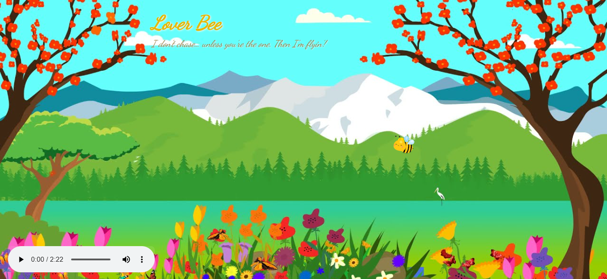

# Lover Bee 🐝🍯🌸


## Basic Details
### Team Name: ByteABiscuit 🍪


### Team Members
- Member 1: Fathima Rida PS - Cochin University Of Science And Technology
- Member 2: Devipriya PR - Cochin University Of Science And Technology

### Project Description
Lover bee 🐝 is a fun little project where a bee follows your cursor around like its's totally in love with you.It's just a silly idea that turned into something kind of cute -- no big purpose,just a bit of fun and some smooth movement.

### The Problem (that doesn't exist)
Our buzzing bee just follows your cursor around, making your screen way more fun and a bit less boring. It doesn’t fix any real problems, but hey, sometimes you just need a cute little bee to keep you company while you work or procrastinate.

### The Solution (that nobody asked for)
We built a bee. That follows your cursor. That’s it. That’s the whole thing :) 🐝🖱️

Wherever your mouse goes, the bee goes. It buzzes around, does nothing useful, and brings absolutely zero productivity benefits. But it looks cute, makes people smile, and turns boring computer time into ✨buzz✨ time.

## Technical Details
### Technologies/Components Used
For Software:
- HTML
- CSS
- JavaScript

For Hardware:
- A standard laptop (and a dream)

# Installation
[```bash
git clone https://github.com/your-repo/lover-bee
cd lover-bee
open index.html]


### Project Documentation

# Screenshots (Add at least 3)


bee!


bee following you!


## Team Contributions
- [Fathima Rida P S]: [building site and vibes]
- [Devipriya P R ]: [building site and vibes]


---
Made with ❤️ at TinkerHub Useless Projects 


